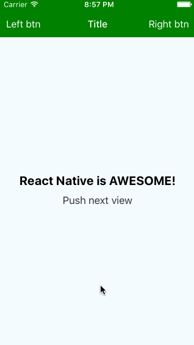
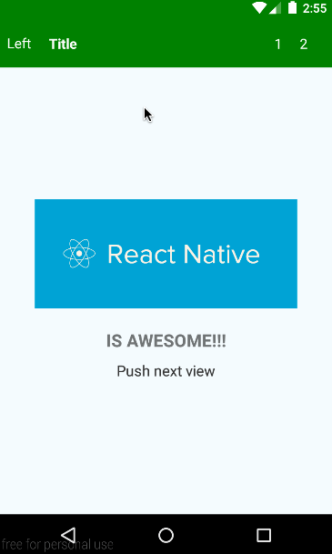

# React Native Yet Another Navigator




## Table of contents
- [Main goals](#main-goals)
- [Installation](#installation)
- [Usage](#usage)
- [Contributing](#contributing)
- [Copyright and license](#copyright-and-license)

## Main goals
- the scene can handle navigation bar items events
- the scene can change navigation bar items dynamically
- the scene can show/hide navigation bar dynamically
- the scene itself defines a configuration of the navigation bar

## Installation

First of all, this component uses awesome [react-native-vector-icons](https://github.com/oblador/react-native-vector-icons#readme), so you need to install it (it's simple)...

then,

```javascript
npm install react-native-ya-navigator --save
```

## Usage

### YANavigator component

```javascript
import YANavigator from 'react-native-ya-navigator';

class App extends React.Component {
  render() {
   return (
     <YANavigator
       initialRoute={{
         component: MyScene,
       }}
       navBarStyle={{
         backgroundColor: 'green',
       }}
     />
   )
  }
}
```

#### YANavigator [propTypes](https://github.com/xxsnakerxx/react-native-ya-navigator/blob/master/Navigator.js#L436):
  - `style`
  - `navBarStyle`
  - `sceneStyle`
  - `initialRoute`
  - `defaultSceneConfig` (default value is __Navigator.SceneConfigs.PushFromRight__ for `iOS`
and __Navigator.SceneConfigs.FadeAndroid__ for `Android`).
  - `useNavigationBar` (useful if you want to render your navBar component on each scene ([ToolbarAndroid](https://facebook.github.io/react-native/docs/toolbarandroid.html#content) for example) instead of the embedded navBar)
  - `navBarUnderlay` (the view that will be rendered under all navBar items ([react-native-blur](https://github.com/react-native-fellowship/react-native-blur) for example))
  - `navBarBackBtn`
    - `icon`
    - `textStyle`
  - `eachSceneProps` (these props will be passed to each scene, for example, if you are using YANavigator inside tabs, you can to pass 'selected' prop to each scene, so each scene can decide should it updated via shouldComponentUpdate if it was hidden)

Also `YANavigator` class has static property `navBarHeight` (you can use it in your styles)

### Navigation bar configuration in a scene

Your scene component should define `static` property `navigationDelegate`

```javascript
class MyScene extends React.Component {
  render() {
    return <View>{this.props.children}</View>
  }

  static navigationDelegate = {
    /**
     * if you want to listen nav bar items press events
     * you must to provide id key
     * @type {Something unique}
     */
    id: 'myScene',
    sceneConfig: myCustomSceneConfig,
    /**
     * false by default
     * @type {bool}
     */
    navBarIsHidden: true|false,
    /**
     * @type {String}
     */
    navBarBackgroundColor: 'red',
    /**
     * @param  {object} props [route props]
     * @return {Class|JSX}
     */
    renderTitle(props) {
      return MyTitleComponent
      // or
      return <MyTitleComponent title={props.title || 'Title'}/>
    },
    /**
     * @param  {object} props [route props]
     * @return {Class|JSX}
     */
    renderNavBarLeftPart(props) {
      return MyButtonComponent
      // or
      return <MyButtonComponent {...props}/>
    },
    /**
     * @param  {object} props [route props]
     * @return {ReactElement|Object}
     */
    renderNavBarRightPart(props) {
      return MyButtonComponent
      // or
      return <MyButtonComponent {...props}/>
    },
    /**
     * will be called first on back android button press
     * @param  {object} navigator [navigator instance]
     */
    onAndroidBackPress(navigator) {
      navigator.popToPop();
    }
    /**
     * If it's true, 'onNavBarBackBtnPress' method will be called on backBtnPress instead
     * of navigator.pop()
     * false by default
     * @type {bool}
     */
    overrideBackBtnPress: true|false,
    /**
     * Tint color of backBtn (applies to icon and text)
     * @type {String}
     */
    navBarBackBtnColor: 'white',
  }
}
```

### Listening navigation bar items events

You should wrap your scene component with `YANavigator.Scene` component and set __this__ to `delegate` prop.
__Don't forget to define `id` in the `navigationDelegate`__

```javascript
class MyScene extends React.Component {
  render() {
    return (
      <YANavigator.Scene
        delegate={this}>
        {this.props.children}
      </YANavigator.Scene>
    )
  }
```

Also `YANavigator.Scene` has `style` prop and `paddingTop` (if it's true(__default value__) then scene will have top padding equals height of the navigation bar, also you can use `YANavigator.navBarHeight` in your styles)

### How to handle navigation bar items events?

There are a few simple rules

- if you pass as navBar item just a `class`, it should have `propTypes` with prop that you want to listen, then you should define method that will be called (`onNavBarTitlePress`, `onNavBarLeftPartPress`, `onNavBarRightPartPress`, `onNavBarTitleChange`, `onNavBarTitleValueChange`, etc...)
- if you pass as navBar item `JSX`, then props that you want to listen should return just a string - __name of the delegate method that will be called__
- currently supported props `onPress`, `onChange`, `onValueChange`, 'onSelection'

```javascript
class MyNavBarTitle extends React.Component {
  render() {
    return (
      <TouchableOpacity onPress={this.props.onPress}>
        <Text>{'Default Text'}</Text>
      </TouchableOpacity>
    )
  }

  static propTypes = {
    onPress: React.PropTypes.func, // required
  }
}

class MyScene extends React.Component {
  onNavBarTitlePress(e) {
    // press event
    console.log(e)
  }

  onFirstBtnPress(e) {
    alert('Right side - first btn press');
  }

  onSecondBtnPress(e) {
    alert('Right side - second btn press');
  }

  render() {
    return (
      <YANavigator.Scene
        delegate={this}>
        {this.props.children}
      </YANavigator.Scene>
    )
  }

  static navigationDelegate = {
    id: 'myScene',
    renderTitle() {
      return MyNavBarTitle;
    },
    renderNavBarLeftPart() {
      return (
        <View style={{flexDirection: 'row'}}>
          <TouchableOpacity onPress={() => 'onFirstBtnPress'}>
            <Text style={{fontSize: 16, paddingLeft: 20, color: '#fff'}}>{'1'}</Text>
          </TouchableOpacity>
          <TouchableOpacity onPress={() => 'onSecondBtnPress'}>
            <Text style={{fontSize: 16, paddingLeft: 20, color: '#fff'}}>{'2'}</Text>
          </TouchableOpacity>
        </View>
      )
    }
  }
```

### How to change navigation bar items dynamically?

There are two options:

1. Each scene can access to navBar items via `ref` (__leftPart__, __rightPart__, __title__) and modify its state using standard `setState` method, or can call other methods provided by your component.
2. If you want re-render your navBar component with new props or just re-render, then you should use navBar's `updateUI` method

Also NavBar component has some helpful methods
- `show`('fade'|'slide') __default behavior is `fade`__
- `hide`('fade'|'slide') __default behavior is `fade`__


```javascript
class MyNavBarTitle extends React.Component {
  constructor(props) {
    super(props)

    this.state = {
      text: props.text
    }
  }
  render() {
    return (
      <TouchableOpacity onPress={this.props.onPress}>
        <Text>{this.state.text}</Text>
      </TouchableOpacity>
    )
  }

  static propTypes = {
    onPress: React.PropTypes.func,
    text: React.PropTypes.string,
  }

  static defualtProps = {
    text: 'Default Text',
  }
}

class MyScene extends React.Component {
  onBtnPress() {
    this.props.navigator._navBar
    updateUI({
      title: <MyNavBarTitle text={'Re rendered'}>,
      rightPart: (
        <TouchableOpacity onPress={() => 'onBtnPress'}>
          <Text style={{fontSize: 12}}>{'Updated btn'}</Text>
        </TouchableOpacity>
      ),
      // leftPart: <MyAwesomeBtn text={'left'}/>,
    })
  }

  onNavBarTitlePress() {
    this.props.navigator._navBar.refs.title.setState({
      text: 'Other title',
    })
  }

  render() {
    return (
      <YANavigator.Scene
        delegate={this}>
        {this.props.children}
      </YANavigator.Scene>
    )
  }

  static navigationDelegate = {
    id: 'myScene',
    renderTitle() {
      return MyNavBarTitle;
    },
    renderNavBarRightPart() {
      return (
        <TouchableOpacity onPress={() => 'onBtnPress'}>
          <Text style={{fontSize: 16, paddingLeft: 20, color: '#fff'}}>{'Btn'}</Text>
        </TouchableOpacity>
      )
    }
  }
```

#### Feel free to go to [example](example) and explore it for more details

## Contributing

Just submit a pull request!

## Copyright and license

Code and documentation copyright 2015 Dmitriy Kolesnikov. Code released under the [MIT license](LICENSE).
