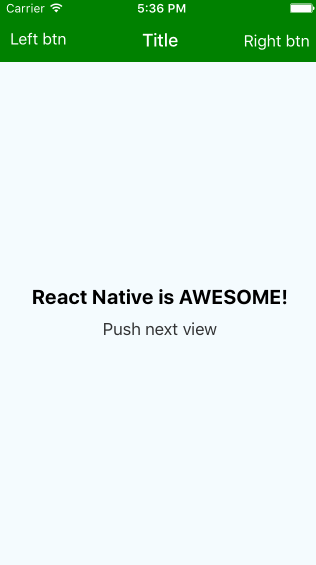

# React Native Yet Another Navigator



## Table of contents
- [Main goals](#main-goals)
- [Installation](#installation)
- [Usage](#usage)
- [Contributing](#contributing)
- [Copyright and license](#copyright-and-license)

## Main goals
- scene can handle press events on navigation bar items
- scene can change navigation bar items dynamically
- scene can show/hide navigation bar dynamically
- scene itself defines configuration of navigation bar


## Installation


```javascript
npm install react-native-ya-navigator --save
```

## Usage

### YANavigator component

```javascript
import YANavigator from 'react-native-ya-navigator';

class App extends React.Component {
  render() {
   return (
     <YANavigator
       initialRoute={{
         component: MyScene,
       }}
       navBarStyle={{
         backgroundColor: 'green',
       }}
       navBarComponentsDefaultStyles={{
         title: {
           color: '#fff',
           marginVertical: 11,
           fontWeight: '500',
         },
         leftBtn: {
           color: '#fff',
           marginVertical: 11,
           marginLeft: 10,
         },
         rightBtn: {
           color: '#fff',
           marginVertical: 13,
           marginRight: 10,
         }
       }}
     />
   )
  }
}
```

Also you can provide `style` prop and `defaultSceneConfig` (default value is __Navigator.SceneConfigs.PushFromRight__ for `iOS`
and __Navigator.SceneConfigs.FadeAndroid__ for `Android`).

### Navigation bar configuration in a scene

Your scene component should define `static` property `navigationDelegate`

```javascript
class MyScene extends React.Component {
  render() {
    return <View>{this.props.children}</View>
  }

  static navigationDelegate = {
    /**
     * if you want to listen nav bar items press events
     * you must to provide id key
     * @type {Something unique}
     */
    id: 'myScene',
    sceneConfig: myCustomSceneConfig,
    /**
     * false by default
     * @type {bool}
     */
    navBarIsHidden: true|false,
    /**
     * @param  {object} props [route props]
     * @return {ReactElement|Object}
     */
    getNavBarTitle(props) {
      return {
        text: 'Title',
        style: {
          color: 'white',
        }
      }
      // or
      return MyTitleComponent
      // or
      return <MyTitleComponent {...props}/>
    },
    /**
     * @param  {object} props [route props]
     * @return {ReactElement|Object}
     */
    getNavBarLeftBtn(props) {
      return {
        text: 'Left btn',
        style: {
          color: 'white',
        }
      }
      // or
      return MyButtonComponent
      // or
      return <MyButtonComponent {...props}/>
    },
    /**
     * @param  {object} props [route props]
     * @return {ReactElement|Object}
     */
    getNavBarRightBtn(props) {
      return {
        text: 'Right btn',
        style: {
          color: 'white',
        }
      }
      // or
      return MyButtonComponent
      // or
      return <MyButtonComponent {...props}/>
    }
  }
}
```

### Listening navigation bar items press events

You should wrap your scene component with `YANavigator.Scene` component and set __this__ to `delegate` prop.
__Don't forget to define `id` in the `navigationDelegate`__

```javascript
class MyScene extends React.Component {
  render() {
    return (
      <YANavigator.Scene
        delegate={this}>
        {this.props.children}
      </YANavigator.Scene>
    )
  }
```

Also `YANavigator.Scene` has `style` prop and `paddingTop` (if it's true(__default value__) then scene will have top padding equals height of the navigation bar, also you can use `YANavigator.navBarHeight` in your styles)

### How to handle navigation bar items press events

```javascript
class MyScene extends React.Component {
  onNavBarTitlePress() {
    // handle title press event here
  }

  onNavBarRightBtnPress() {
    // handle right btn press event here
  }

  onNavBarLeftBtnPress() {
    // handle left btn press event here
  }

  render() {
    return (
      <YANavigator.Scene
        delegate={this}>
        {this.props.children}
      </YANavigator.Scene>
    )
  }

  static navigationDelegate = {
    id: 'myScene',
    getNavBarTitle() {
      return {
        text: 'Press me!',
        onPress: true,
      }
    }
  }
```

### How to change navigation bar items dynamically

It's little bit tricky :) YANavigator render custom NavBar component that has some helpful methods
- setTitle
- setLeftBtn
- setRightBtn
- show
- hide


```javascript
class MyScene extends React.Component {
  onNavBarTitlePress() {
    this.props.navigator._navBar
    setTitle('New title')
  }

  render() {
    return (
      <YANavigator.Scene
        delegate={this}>
        {this.props.children}
      </YANavigator.Scene>
    )
  }

  static navigationDelegate = {
    id: 'myScene',
    getNavBarTitle() {
      return {
        text: 'Press me!',
        onPress: true,
      }
    }
  }
```

#### Feel free to go to [example](example) and explore it for more details

## Contributing

Just submit a pull request!

## Copyright and license

Code and documentation copyright 2015 Dmitriy Kolesnikov. Code released under the [MIT license](LICENSE).
